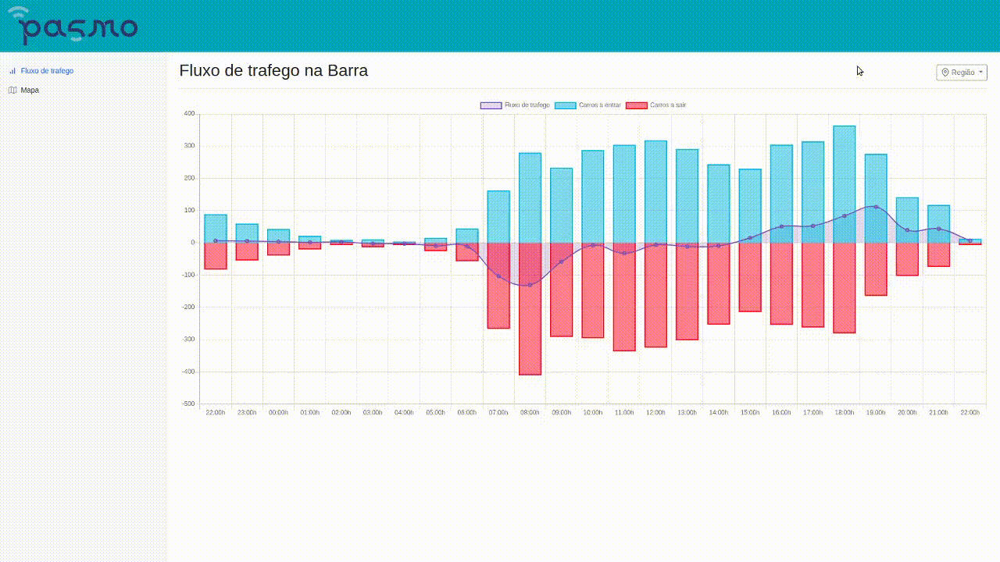

<!-- PROJECT SHIELDS -->

<!--

*** I'm using markdown "reference style" links for readability.

*** Reference links are enclosed in brackets [ ] instead of parentheses ( ).

*** See the bottom of this document for the declaration of the reference variables

*** for contributors-url, forks-url, etc. This is an optional, concise syntax you may use.

*** https://www.markdownguide.org/basic-syntax/#reference-style-links

-->

  

<!-- PASMO LOGO -->

<br  />
<p  align="center">
<a  href="http://pasmo.av.it.pt/">

</a>

<h3  align="center">PASMO examples</h3>

<p  align="center">
Platform that provides some examples on how to access and manipulate data from the API that the PASMO project provides.
<br  />
<a  href="https://pasmo.es.av.it.pt/docs/"><strong>Explore the API documentation</strong></a>
<br  />
<br  />

<!-- <a href="https://github.com/othneildrew/Best-README-Template">View Demo</a>
· -->

<a  href="https://github.com/othneildrew/Best-README-Template/issues">Report Bug</a>
·
<a  href="https://github.com/othneildrew/Best-README-Template/issues">Request Feature</a>
</p>
</p>

<!-- TABLE OF CONTENTS -->

## Table of Contents

*  [About the Project](#about-the-project)
*  [Built With](#built-with)
*  [Getting Started](#getting-started)
*  [Usage](#usage)
*  [Usage of the API](#usage-of-the-api)
*  [Contact](#contact)
  

<!-- ABOUT THE PROJECT -->

## About The Project

The main goal of PASMO is to provide an open platform where researchers can test technologies and develop their ideas.

This GitHub provides examples on how to use data provided by the PASMO project, and how to access the REST API that gives this data.

The examples provided do not use all the calls available in the API, so to further investigate visit the <a  href="https://pasmo.es.av.it.pt/docs/">documentation page</a>.

These examples are only a way to show how the data can be handled, other libraries can be used to build charts and maps.

### Built With

Several libraries were used to help build the structure of the demonstrations, charts and maps.

Some were downloaded and used locally such as:

*  [Bootstrap](https://getbootstrap.com)
*  [Popper](https://popper.js.org/)

Others are delivered by Content Delivery Network(CDN):
*  [ChartJS](https://www.chartjs.org/)
*  [JQuery](https://jquery.com)
*  [GoogleMaps API](https://developers.google.com/apis-explorer)
*  [Feather Icons](https://feathericons.com/)

  

<!-- GETTING STARTED -->

## Getting Started

The examples provided can be cloned and used, all the libraries are installed. To view the google maps, an API key is necessary and can be retrieved <a  href="https://developers.google.com/maps/documentation/javascript/get-api-key">here</a>.

After getting the API key, place it nearly the end of the index.html, replacing "YOUR-KEY-HERE".

```sh
<script src="https://maps.googleapis.com/maps/api/js?key=YOUR-KEY-HERE&callback=parkingMap"></script>
```
  
<!-- USAGE EXAMPLES -->

## Usage

The demonstration is written in JavaScript, so this means that it can be viewed simply by opening index.html.

### Usage of the API

On the first page, where the traffic flow is shown, a chart was built using the request that gives information about the events in different regions.
Get number of cars entering Barra, per hour on the 20th of April 2020

```sh
https://pasmo.es.av.it.pt/api/radars/events/barra/cars_in?initialDate=2020-04-20T00:00:00Z&finalDate=2020-04-20T23:59:59Z&groupby=3600

```



On the second page, where the map is displayed, two different requests were used, one to provide the location of the parking sensors, and other to provide the state of the parking lot, i.e., if it is free or occupied.

Get all sensor location

```sh
https://pasmo.es.av.it.pt/api/parking/availableSensors?state=available

```

Get recent state of the sensors

```sh
https://pasmo.es.av.it.pt/api/parking/latestValues

```


The data is then merged to build a map with the parking sensors location and change the color of the icons, depending on their state(green if they are free and red if they are occupied). Because it is built on top of google maps, it is possible to go to street view and see where exactly are the parking lots.

<!-- CONTACT -->

## Contact

[Contact Page](http://pasmo.av.it.pt/contactos/)

Project Link: [http://pasmo.av.it.pt](http://pasmo.av.it.pt)
